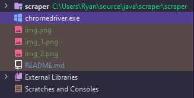
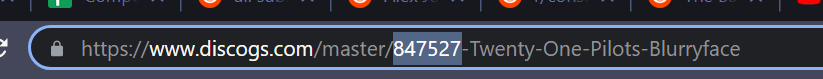
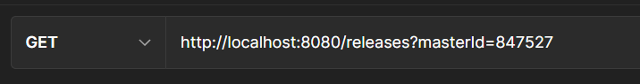
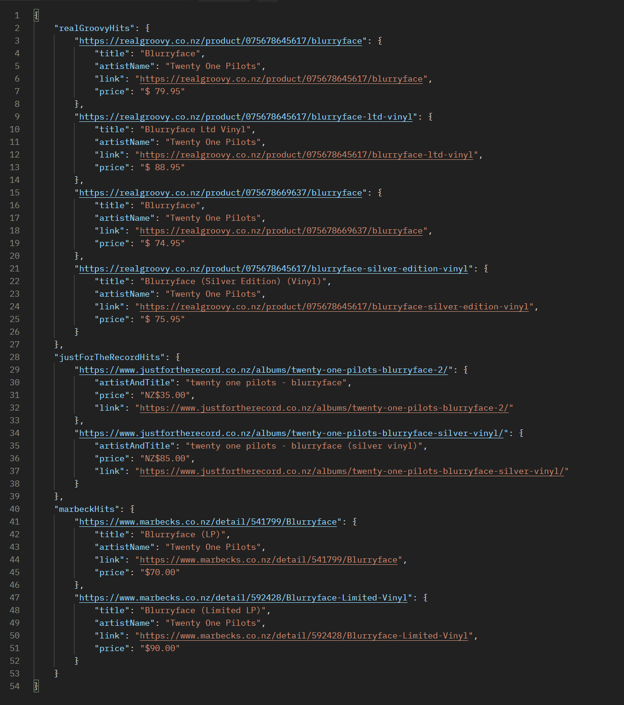

# NZ Record Search Aggregator API

This is a tool used to search multiple online record stores for any available versions of a specific record. 

The current sites that are searched include:
 -  
 - [RealGroovy](https://realgroovy.co.nz/)
 - [Marbecks](https://www.marbecks.co.nz/)
 - [Just For the Record](https://www.justfortherecord.co.nz/)

# How to use
There is a little bit of setup required before you can get going after cloning the repo. First you will need to
[download](https://chromedriver.chromium.org/downloads)
whatever chrome driver matches your system and add it to the root of the project.

The project is also made with jdk 17 so you'll need at least that on your system also. 

Once you have chromedriver downloaded and the project setup in an IDE just go ahead and run it. Next head over to 
[Discogs](https://www.discogs.com/) and search for the MASTER page of the record you are looking for. Once on the page
for the master, copy the number located in the URL; this is what we will use for our search.

Next you'll need to figure out what application you'll use to make the http request. Personally I like using
[Postman](https://www.postman.com/). Once that's sorted you just need to set up a GET request using the master ID from
before.

`http://localhost:8080/releases?masterId={your id goes here}`.

The request will take a LONG time to complete. I haven't coded this in the most efficient way so just let it do its thing. 
Once it's complete you'll get a list of all matches, including links to, every match across the supported websites. 

